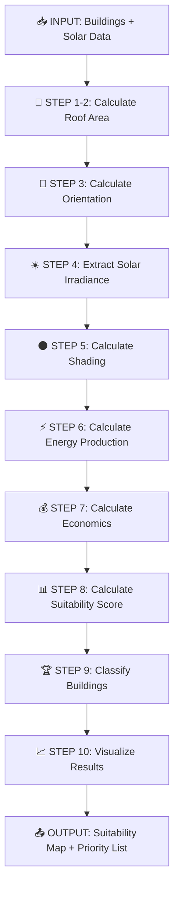

<div align="center">

# ☀️ Solar Panel Suitability Mapping ☀️

### *Identifying optimal rooftops for solar panel installation*


*A geospatial analysis project using Python and vector-based GIS technologies*

---

</div>

## 🎯 Problem Statement

Identify optimal rooftops for solar panel installation by analyzing:
- 🏗️ **Building geometry** (roof area, orientation, slope)
- ☀️ **Solar irradiance** (annual energy potential)
- 🌑 **Shading effects** (nearby obstruction analysis)
- 💰 **Economic viability** (ROI and cost-benefit analysis)

---

## 🛠️ Technologies

<table>
<tr>
<td width="50%">

### 🐍 Core
- **Python 3.8+** - Main programming language

### 🗺️ Geospatial Libraries
- `geopandas` - Vector data manipulation
- `rasterio` - Raster data processing
- `shapely` - Geometric operations
- `folium` / `leafmap` - Interactive mapping
- `pyproj` - CRS transformations

</td>
<td width="50%">

### 📊 Data Analysis
- `numpy` - Numerical computing
- `pandas` - Data wrangling
- `scipy` - Scientific computing

### 📈 Visualization
- `matplotlib` - Static plots
- `seaborn` - Statistical visualization
- `plotly` - Interactive charts

</td>
</tr>
</table>

---

## 📁 Project Structure

```
├── data/                        # Cached API responses (not tracked, generated by scripts)
│   ├── buildings.geojson       # Fetched from Microsoft Building Footprints API
│   ├── osm_attributes.geojson  # Fetched from OpenStreetMap API
│   ├── bag_3d.geojson          # Fetched from PDOK 3D BAG API (building heights)
│   └── solar_irradiance.json   # Fetched from PVGIS API
├── src/                         # Core implementation modules (REQUIRED)
│   ├── __init__.py
│   ├── data_acquisition.py     # API calls and data fetching
│   ├── geometry.py             # Roof area, orientation, slope calculations
│   ├── solar.py                # Energy production calculations
│   ├── shading.py              # Shadow analysis algorithms
│   ├── spatial_search.py       # Search algorithms (KD-tree, binary search, quicksort)
│   ├── ranking.py              # Suitability scoring and ranking
│   ├── api.py                  # REST API/geodata service
│   └── utils.py                # Helper functions
├── tests/                       # Automated unit tests (REQUIRED - 5+ tests)
│   ├── __init__.py
│   ├── test_data_acquisition.py # Test API calls
│   ├── test_geometry.py        # Test geometric calculations
│   ├── test_solar.py           # Test energy calculations
│   ├── test_shading.py         # Test shadow analysis
│   ├── test_spatial_search.py  # Test search algorithms (KD-tree, binary, quicksort)
│   ├── test_ranking.py         # Test ranking algorithms
│   └── test_api.py             # Test API endpoints
├── notebooks/                   # Jupyter notebooks (OPTIONAL - for exploration)
│   ├── 01_data_exploration.ipynb      # Data acquisition and exploration
│   ├── 02_algorithm_development.ipynb # Algorithm testing and refinement
│   └── 03_visualization_demo.ipynb    # Final visualizations
├── outputs/                     # Generated results
│   ├── maps/                   # Choropleth and interactive maps
│   ├── reports/                # Analysis reports
│   └── figures/                # Plots and charts
├── docs/                        # Documentation
│   └── api_documentation.md    # REST API documentation
├── .gitignore                  # Git ignore file (includes data/ folder)
├── requirements.txt            # Python dependencies (REQUIRED)
├── setup.py                    # Package setup file (REQUIRED)
├── pyproject.toml              # Alternative packaging configuration
├── LICENSE                     # License file
└── README.md                   # Project documentation (REQUIRED)
```

**Note:** 
- `data/` folder stores **cached API responses** - it's generated by running data acquisition scripts and should be in `.gitignore`
- `src/data_acquisition.py` contains all API request logic for fetching building footprints, OSM data, and PVGIS solar data
- `src/` and `tests/` contain production code and automated tests (required for our assignment)
- `notebooks/` are optional for exploration and demonstration purposes
- All code should be packaged using `setup.py` or `pyproject.toml` for deployment

---

## 🚀 Installation

```bash
# Clone the repository
git clone https://github.com/ValOnyando/ITC-Solar-Panel-Suitability-Mapping.git
cd ITC-Solar-Panel-Suitability-Mapping

# Create virtual environment
python -m venv venv
source venv/bin/activate  # On Windows: venv\Scripts\activate

# Install dependencies (Option 1: using requirements.txt)
pip install -r requirements.txt

# Or install dependencies manually (Option 2)
pip install geopandas rasterio shapely folium numpy pandas matplotlib seaborn requests pytest
```

---

## 💻 Usage

### 🌤️ Fetch Solar Irradiance Data
```python
import requests

# Example: Fetch PVGIS data for a location
lat, lon = 52.0907, 5.1214  # Utrecht, Netherlands
url = f"https://re.jrc.ec.europa.eu/api/PVcalc?lat={lat}&lon={lon}&outputformat=json"
response = requests.get(url)
solar_data = response.json()
```

### 📐 Calculate Roof Area
```python
import geopandas as gpd
from shapely.geometry import Polygon

# Load building footprints
buildings = gpd.read_file('data/buildings.geojson')

# Calculate roof areas
buildings['roof_area'] = buildings.geometry.area
```

### ⚡ Compute Solar Potential
```python
def calculate_solar_potential(area, irradiance, efficiency=0.18, shading=0.1):
    """
    Calculate solar energy potential for a rooftop.
    
    Parameters:
    - area: Roof area in m²
    - irradiance: Annual solar irradiance in kWh/m²/year
    - efficiency: Panel efficiency (default 18%)
    - shading: Shading factor 0-1 (default 0.1)
    
    Returns:
    - Annual energy production in kWh
    """
    return area * irradiance * efficiency * (1 - shading)

# Apply to buildings
buildings['energy_kwh'] = buildings.apply(
    lambda row: calculate_solar_potential(row['roof_area'], row['irradiance']),
    axis=1
)
```

---

## 📦 Data Sources

| Source | Description | Format |
|--------|-------------|--------|
| 🏢 **[Microsoft Building Footprints](https://github.com/microsoft/USBuildingFootprints)** | Building polygon geometries | GeoJSON |
| 🗺️ **[OpenStreetMap](https://www.openstreetmap.org/)** | Building attributes (height, type) | Open Buildings 2.5D |
| ☀️ **[PVGIS API](https://re.jrc.ec.europa.eu/pvg_tools/en/)** | Solar irradiance data | GeoJSON |
| �️ **[PDOK 3D BAG](https://3dbag.nl/)** | 3D building data with roof heights | GeoJSON/CityJSON |

---

## 🔬 Methodology

### 🧮 Algorithms & Methods

<details open>
<summary><strong>1️⃣ Geometric Analysis</strong></summary>

- 📏 Roof area calculation using building footprint coordinates
- 🧭 Roof orientation (aspect) determination
- 📐 Roof slope angle analysis (for pitched roofs when available)
- 💡 Implementation using OOP and Functional Programming paradigms

</details>

<details open>
<summary><strong>2️⃣ Shadow Analysis</strong></summary>

- 🌑 Nearby building obstruction modeling
- ⏰ Temporal shading calculations

</details>

<details open>
<summary><strong>3️⃣ Energy Calculation</strong></summary>

- ⚡ Solar potential estimation per building
- 🔋 Efficiency considerations

</details>

<details open>
<summary><strong>4️⃣ Priority Ranking</strong></summary>

- 💰 Cost-benefit analysis
- 📊 Return on investment (ROI) calculations

</details>

<details open>
<summary><strong>5️⃣ Search Algorithms</strong></summary>

- 🌳 **KD-tree Spatial Index** - Efficient nearest neighbor and range queries (O(log n))
- 🔍 **Binary Search** - Find buildings by score threshold (O(log n))
- ⚡ **Quicksort** - Sort buildings by suitability (O(n log n) average)
- 📌 **Linear Search** - Find buildings by ID (O(n))
- 🏆 **Top-K Selection** - Heap-based partial sort for priority lists (O(n log k))

</details>

### 📐 Mathematical Formulation

> **Solar Potential Energy:**
$$E = A \times H \times \eta \times (1 - S)$$

Where:
- $E$ = Energy production (kWh)
- $A$ = Roof area (m²)
- $H$ = Solar irradiance (kWh/m²/year)
- $\eta$ = Panel efficiency (%)
- $S$ = Shading factor (0-1)

> **Return on Investment:**
$$ROI = \frac{E \times Price - Cost}{Cost}$$

Where:
- $Price$ = Energy price per kWh
- $Cost$ = Installation cost

### 🔄 Processing Pipeline



<details>
<summary>View text-based pipeline</summary>

```
INPUT → Buildings + Solar Data
  ↓
STEP 1-2: Calculate roof area (geometry)
  ↓
STEP 3: Calculate orientation (geometry)
  ↓
STEP 4: Extract solar irradiance (raster overlay)
  ↓
STEP 5: Calculate shading (spatial analysis)
  ↓
STEP 6: Calculate energy production (formula)
  ↓
STEP 7: Calculate economics (formula)
  ↓
STEP 8: Calculate suitability score (weighted combination)
  ↓
STEP 9: Classify buildings (categories)
  ↓
STEP 10: Visualize results (maps & charts)
  ↓
OUTPUT → Suitability map + priority list
```

**Note:** Vector data is prioritized throughout the workflow, with raster operations used only when necessary for efficiency.

</details>

---

## 🧪 Testing

Unit tests are implemented for critical components:

| Component | Status |
|-----------|--------|
| Roof area calculation algorithms | ✅ |
| Solar energy estimation functions | ✅ |
| Building ranking algorithms | ✅ |
| Geometric analysis functions | ✅ |

**Run tests:**
```bash
pytest tests/ -v
pytest tests/ --cov=src  # With coverage report
```

---

## 📊 Visualizations

<table>
<tr>
<td width="33%">

### 🗺️ Choropleth Maps
- Solar potential by neighborhood
- Average suitability by district

</td>
<td width="33%">

### 🎨 Interactive Maps
- Color-coded suitability scores
- Click-to-view building metrics
- Layered parameter visualization

</td>
<td width="33%">

### 📈 Analytical Plots
- Roof area vs. energy
- Orientation vs. irradiance
- Suitability histograms
- ROI distribution curves

</td>
</tr>
</table>

---

## 📄 License

This project is licensed under the MIT License - see the [LICENSE](LICENSE) file for details.

---

## 🤝 Contributing

Contributions are welcome! Here's how you can help:

1. 🍴 Fork the repository
2. 🔨 Create a feature branch (`git checkout -b feature/AmazingFeature`)
3. 💾 Commit your changes (`git commit -m 'Add some AmazingFeature'`)
4. 📤 Push to the branch (`git push origin feature/AmazingFeature`)
5. 🎉 Open a Pull Request

---

## 📧 Contact

💬 For questions or collaboration opportunities, please open an issue. 
You can also reach me at: valonyando@gmail.com - mohammadanwarx99@gmail.com,  Vallary Onyando and Mo Anwar.

---

<div align="center">

**Made with ☀️ and 🐍 for a sustainable future**


</div>